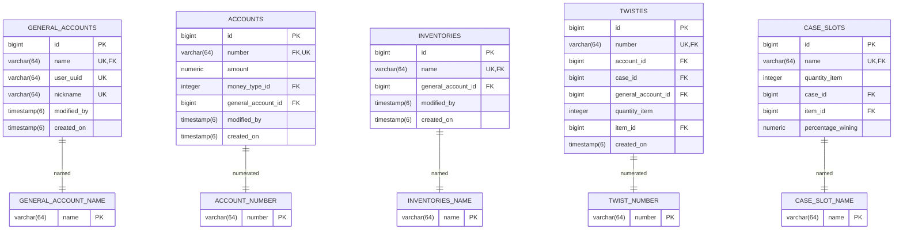

# Twister
Service with OAuth2 authorization. With the ability to store and transfer play money and items, as well as the possibility of issuing and remitting play money through twists.

Demo: https://twister.fvds.ru:9443/
## Model sheme
### Autogenerated
Tables to maintain sequnced and autogenerate names and numbers.

### User possessions

#### Interserver relationship

A separate auth server for OAuth2 forces a cross-server connection via the uuid that will be in the jwt.

#### General account
Each general account can own accounts for a certain type of money and inventory for storing items.

#### Inventory
So each inventory contains slots for some item.

##### Inventory slot
Each slot contains both the number of items and the items themselves.

#### Account
Each account is tied to some type of money.

#### Full
So, the full ownership scheme:

### Infrastructure around
#### Item
There are currently two types of items: trash and money. The key difference is that ItemMoney has a price in the form of some type of money.

#### Case
The case consists of slots with items and a certain chance of falling out, as well as the cost in the equivalent of a certain type of money.

#### Twist
TWIST - logging table for each twist case. TWIST_MARK - conditional trigger table to account for case cooldowns. There is a condition whether it is worth considering this mark at all.

### Full
Full scheme:
