# Twister Resource Server
Stateless CQRS and REST API [resource server](https://www.oauth.com/oauth2-servers/the-resource-server/).

## Model scheme
### Autogenerated
Tables to maintain sequnced and autogenerate names and numbers.
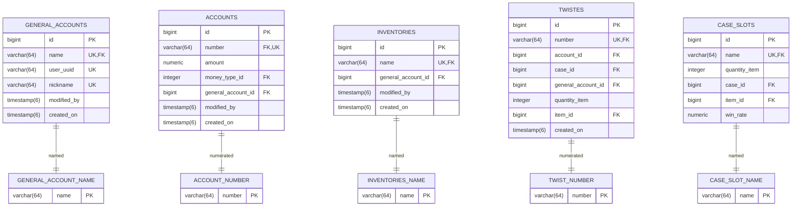

### User possessions

#### Interserver relationship

A separate auth server for OAuth2 forces a cross-server connection via the uuid that will be in the jwt.
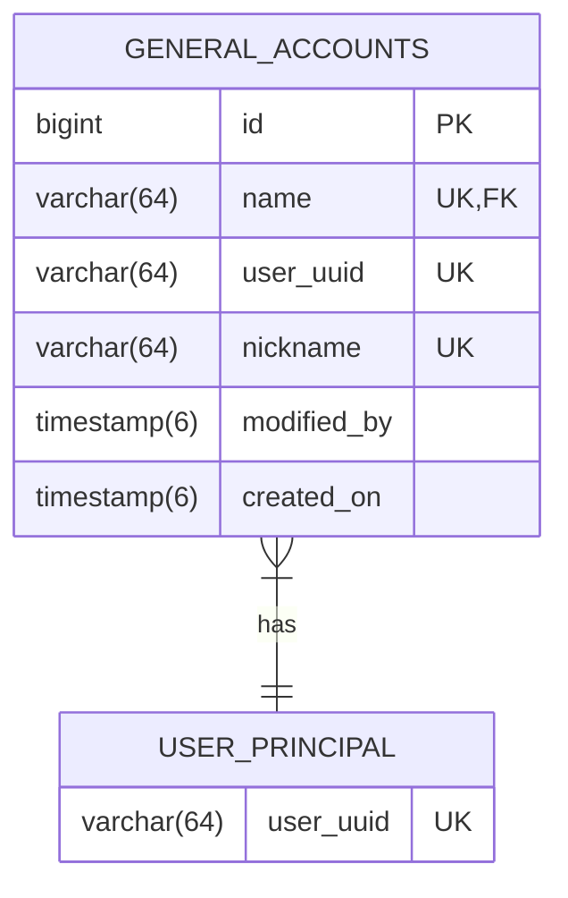

#### General account
Each general account can own accounts for a certain type of money and inventory for storing items.

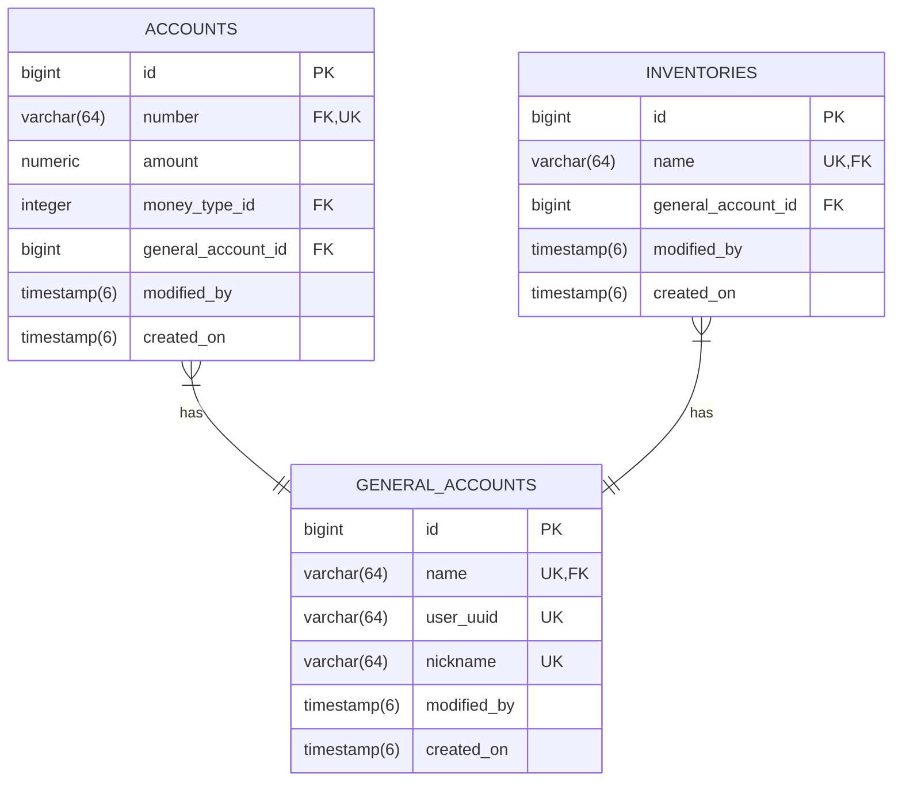
#### Inventory
So each inventory contains slots for some item.
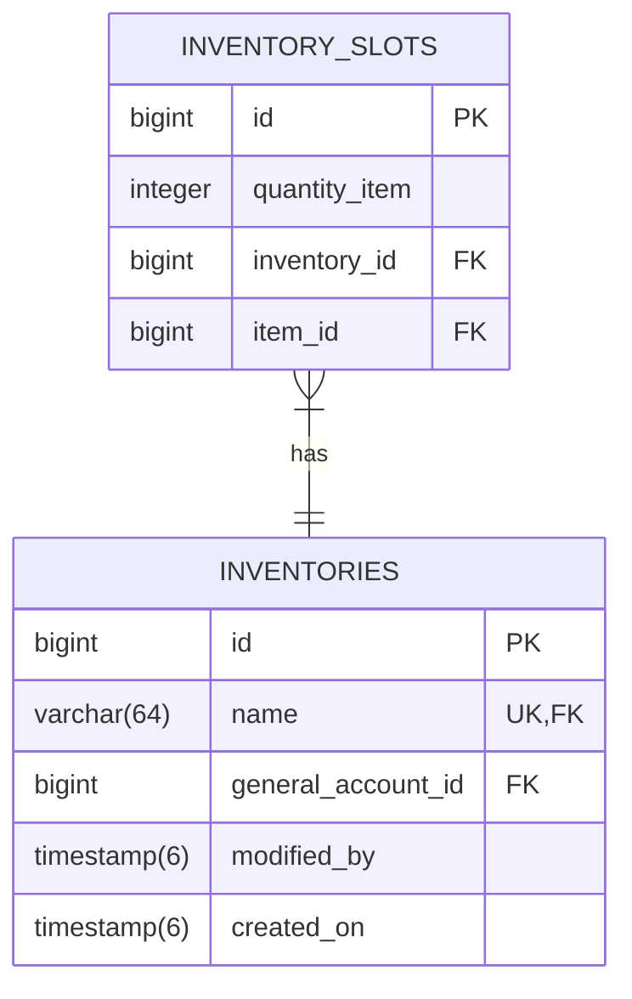
##### Inventory slot
Each slot contains both the number of items and the items themselves.
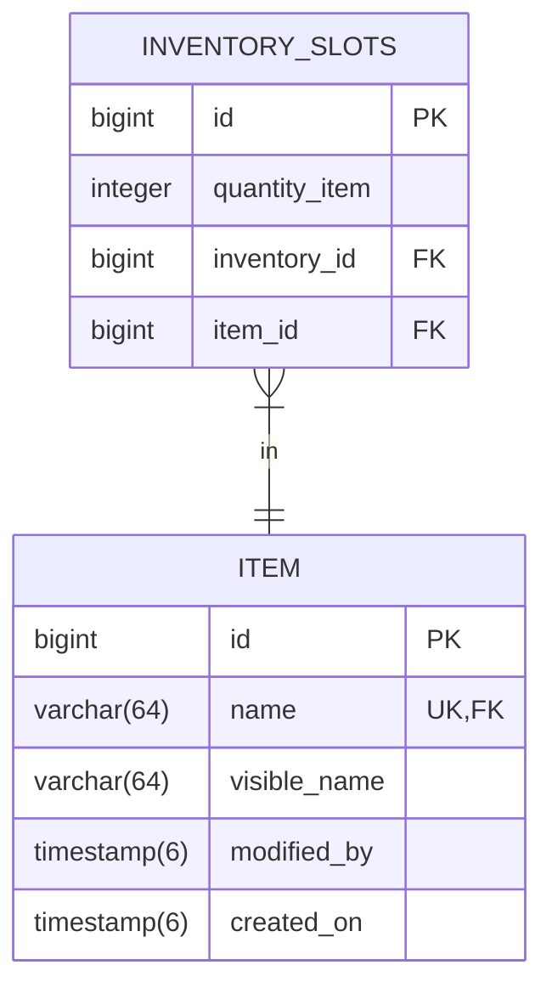
#### Account
Each account is tied to some type of money.

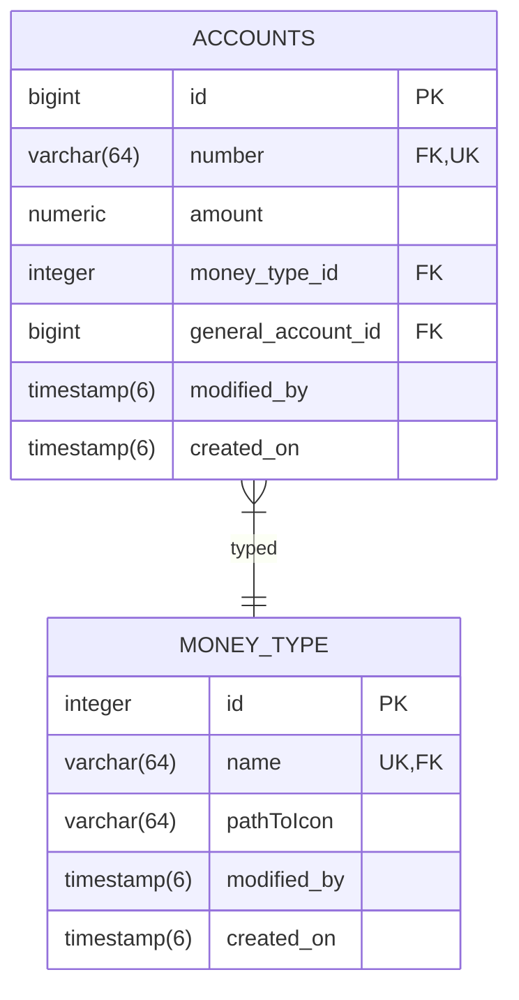

#### Full
So, the full ownership scheme:
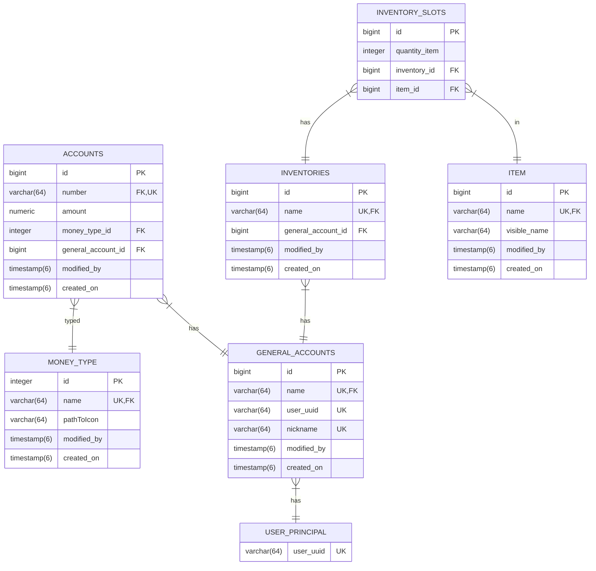

### Infrastructure around
#### Item
There are currently two types of items: trash and money. The key difference is that ItemMoney has a price in the form of some type of money.
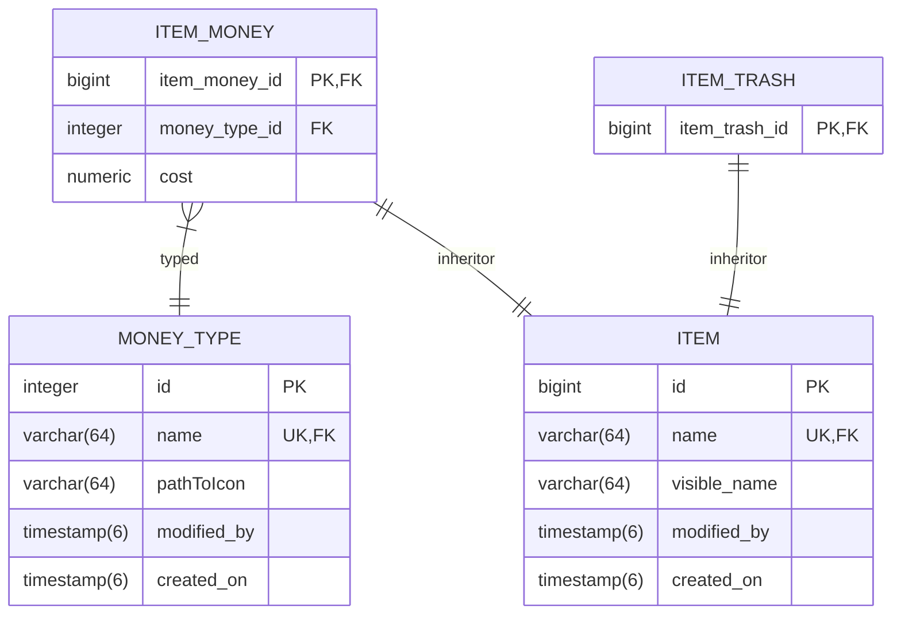
#### Case
The case consists of slots with items and a certain chance of falling out, as well as the cost in the equivalent of a certain type of money.
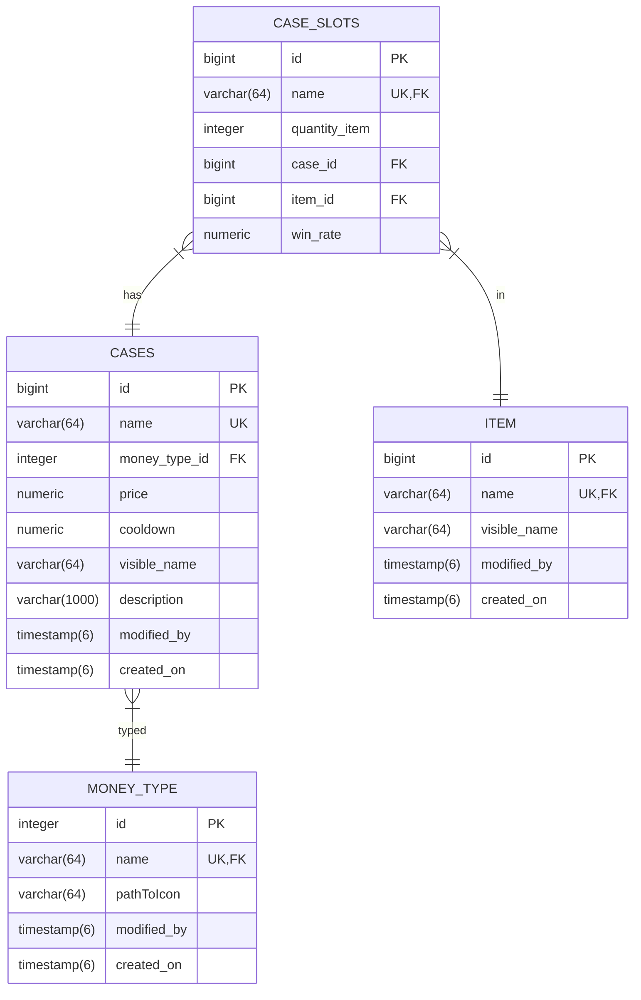
#### Twist
TWIST - logging table for each twist case. TWIST_MARK - conditional trigger table to account for case cooldowns. There is a condition whether it is worth considering this mark at all.
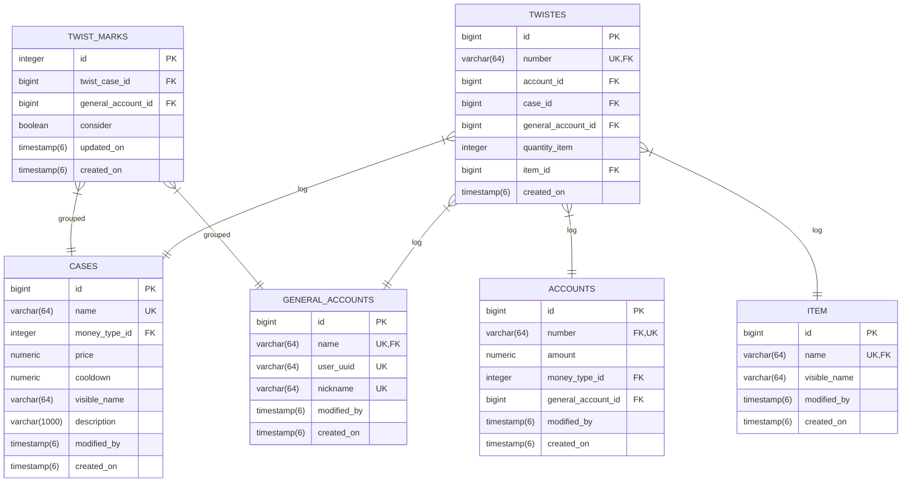

### Full
Full scheme:
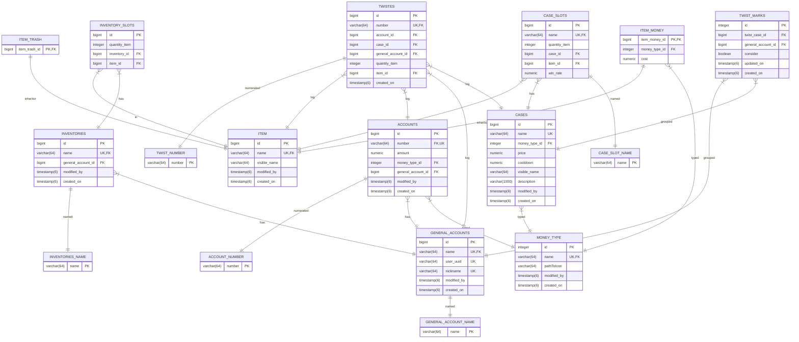
## Component scheme
Because the service is CQRS, the components have limitations. 

Firstly, only `@Repository`, `@InformationService`, `@RegisterService`, `@MergeService` are allowed to `@Autowired` repository `@Component`s.
Secondly,
- if `@Repository` does not have restrictions on the applicable methods in these repositories, but the latter cannot `@Autowired` other services;

- `@InformationService` - can only be used by `Repository#find`/`Repository#get`;

- `@RegisterService` - can only be used by `EntityManager#persistence`;

- `@MergeService` - can only be used by `EntityManager#merge`;

- `@PutService` - can only be used by `Repository#find`/`Repository#get`.

Thus, each service always returns `@Dto`, which means the persistence context cannot go beyond the previously designated service types. The problem of passing `@Entity` without persistence context is solved by `@MappingDto`. It turns out that if you need to somehow modify an `@Entity`, then from `@InformationService` you get `@MappingDto`, which is mapped to `@Entity`, some action is performed on it, this `@Entity` is again mapped to some `@MappingDto` and passed to `@MergeService`. The problem of n+1 and the Cartesian product is solved by the complete absence of `@OneToMany` in `@Entity`, as well as the ability to save `@ManyToOne` only by id.

Now you can easily introduce a division: all services that have a persistence context are collected in the services.managers package.
### Transfer Money Service
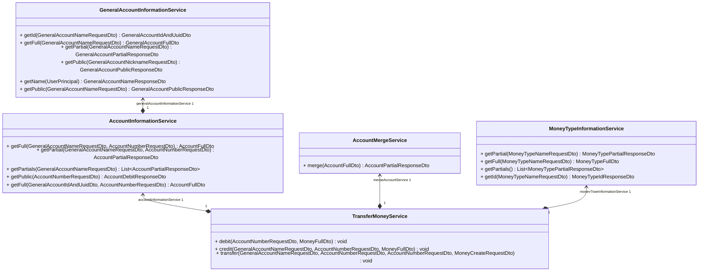
### Transfer Item Service 
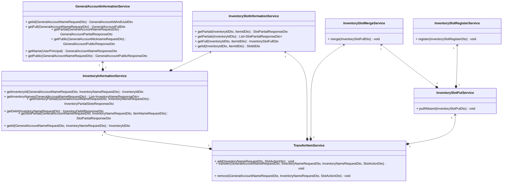
### Shop Service
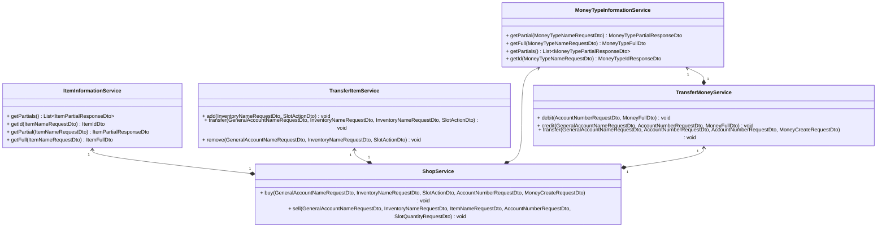

### Twist Service
```mermaid
classDiagram
direction BT
class AccountInformationService {
  + getFull(GeneralAccountNameRequestDto, AccountNumberRequestDto) AccountFullDto
  + getPartial(GeneralAccountNameRequestDto, AccountNumberRequestDto) AccountPartialResponseDto
  + getPartials(GeneralAccountNameRequestDto) List~AccountPartialResponseDto~
  + getPublic(AccountNumberRequestDto) AccountDebitResponseDto
  + getFull(GeneralAccountIdAndUuidDto, AccountNumberRequestDto) AccountFullDto
}
class CaseActualInformationService {
  + getPage(int, int, GeneralAccountNameRequestDto) CasePagePartialResponseDto
  + getFull(GeneralAccountNameRequestDto, CaseNameRequestDto) CaseFullDto
  + getPartialItems(GeneralAccountNameRequestDto, CaseNameRequestDto) CaseItemsPartialResponseDto
}
class CaseSlotInformationService {
  + getFullsOrdersWinRate(CaseIdDto) List~CaseSlotFullDto~
  + getPartials(CaseIdDto) List~CaseSlotPartialResponseDto~
}
class GeneralAccountInformationService {
  + getId(GeneralAccountNameRequestDto) GeneralAccountIdAndUuidDto
  + getFull(GeneralAccountNameRequestDto) GeneralAccountFullDto
  + getPartial(GeneralAccountNameRequestDto) GeneralAccountPartialResponseDto
  + getPublic(GeneralAccountNicknameRequestDto) GeneralAccountPublicResponseDto
  + getName(UserPrincipal) GeneralAccountNameResponseDto
  + getPublic(GeneralAccountNameRequestDto) GeneralAccountPublicResponseDto
}
class ShopService {
  + buy(GeneralAccountNameRequestDto, InventoryNameRequestDto, SlotActionDto, AccountNumberRequestDto, MoneyCreateRequestDto) void
  + sell(GeneralAccountNameRequestDto, InventoryNameRequestDto, ItemNameRequestDto, AccountNumberRequestDto, SlotQuantityRequestDto) void
}
class TwistMarkInformationService {
  + getFull(GeneralAccountIdAndUuidDto, CaseIdDto) TwistMarkFullDto
}
class TwistMarkMergeService {
  + merge(TwistMarkFullDto) void
}
class TwistMarkPutService {
  + putIfAbsent(TwistMarkPutDto) void
}
class TwistMarkRegisterService {
  + register(TwistMarkRegisterDto) void
}
class TwistRegisterService {
  + register(CaseFullDto, GeneralAccountIdAndUuidDto, AccountFullDto, CaseSlotFullDto) TwistPartialResponseDto
  + register(TwistRegisterDto) TwistPartialResponseDto
}
class TwistService {
  + twist(GeneralAccountNameRequestDto, InventoryNameRequestDto, AccountNumberRequestDto, CaseNameRequestDto) TwistPartialResponseDto
}

AccountInformationService "1" *--> "generalAccountInformationService 1" GeneralAccountInformationService 
CaseActualInformationService "1" *--> "caseSlotInformationService 1" CaseSlotInformationService 
CaseActualInformationService "1" *--> "generalAccountInformationService 1" GeneralAccountInformationService 
TwistMarkPutService "1" *--> "twistMarkMergeService 1" TwistMarkMergeService 
TwistMarkPutService "1" *--> "twistMarkRegisterService 1" TwistMarkRegisterService 
TwistService "1" *--> "accountInformationService 1" AccountInformationService 
TwistService "1" *--> "caseActualInformationService 1" CaseActualInformationService 
TwistService "1" *--> "caseSlotInformationService 1" CaseSlotInformationService 
TwistService "1" *--> "generalAccountInformationService 1" GeneralAccountInformationService 
TwistService "1" *--> "shopService 1" ShopService 
TwistService "1" *--> "twistMarkInformationService 1" TwistMarkInformationService 
TwistService "1" *--> "twistMarkMergeService 1" TwistMarkMergeService 
TwistService "1" *--> "twistMarkPutService 1" TwistMarkPutService 
TwistService "1" *--> "twistRegisterService 1" TwistRegisterService 
```